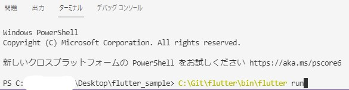

# flutter_sample

これは NSK 117期・同期一同で作成する flutter の最初のプロジェクトです．

## 開発環境の作り方

ここではWindowsの導入方法を説明します．Macはまた今度．なかしーすまん．  
基本的には以下のサイトを参考にしてるので，不明点はここを見てください．  

[公式](https://docs.flutter.dev/get-started/install/windows) / [初心者向け](https://qiita.com/apricotcomic/items/7ff53950e10fcff212d2)

### Git の入手

絶対的に必要です．入れてください．[これ](https://miya-system-works.com/blog/detail/128)とかを参考に頑張って．  

### flutter の導入

Git の `clone` で入手しましょう．練習にもなるし．  
`Win+R` で `cmd` と打ってください．  
その後，以下のコマンドを実行してください．

```console clone
cd {クローンしたい場所} （楠崎はC:\Git）
git clone https://github.com/flutter/flutter.git -b stable
```


フォルダに flutter が入っていることを確認の後，次のコマンドを実行してください．

```console install
cd {クローンした場所}\flutter\bin
```

一つ一つ順番に実行しましょう．（各1分くらいかかるかな？）

```console flutter
flutter
```

```console flutter.bat
flutter.bat
```

```console dart
dart
```

```console dart.bat
dart.bat
```

### VSCode の入手とプラグインの導入

まずは[公式](https://code.visualstudio.com/)から VSCode をインストールしてください．  
  
次に，[ここ](https://marketplace.visualstudio.com/items?itemName=Dart-Code.flutter)から flutter のプラグインを入手してください．  

### このプロジェクトの取得

VSCode を起動して最初に出る，`Git リポジトリのクローン...` を実行して，`https://github.com/kojik-umich/flutter_sample.git` を入力．  


次に，クローンしたい場所を選択してください．楠崎は `Desktop` にしました．

## このプロジェクトの実行方法

ファイルエクスプローラーでクローンしたプロジェクト開いてください．  
（普通にやってれば何もしなくても開くはずです．）

### webページの立ち上げ

VScodeで `Ctrl+Shift+@` でターミナルを起動．



```console this_project_run
{flutter入れた場所}\bin\flutter run
```

これで `1` を選択すれば Chrome でプログラムが立ち上がるはずです．  
  


おしまい
